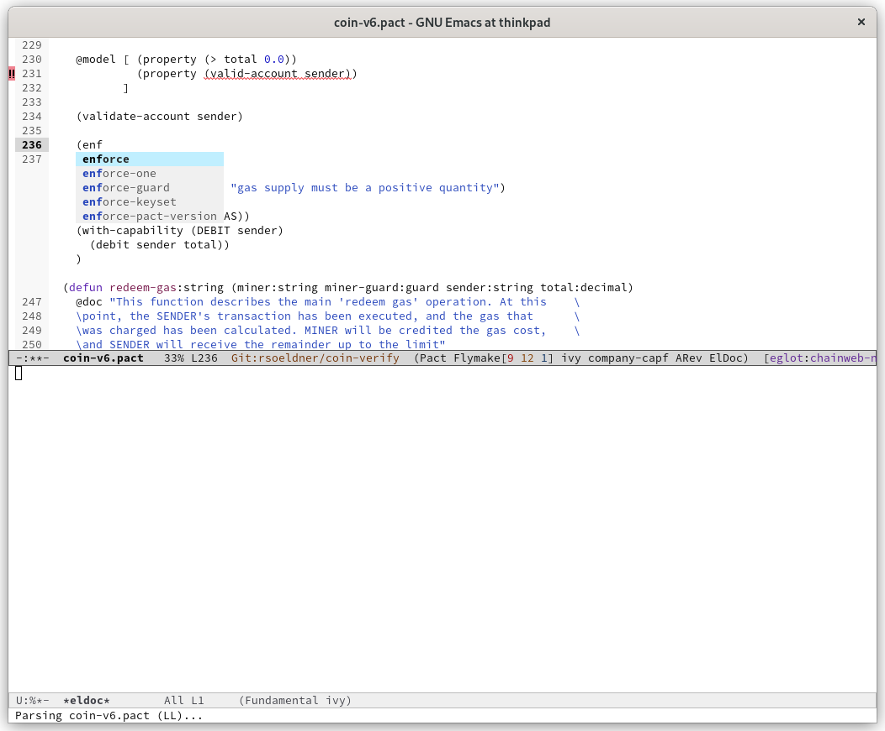
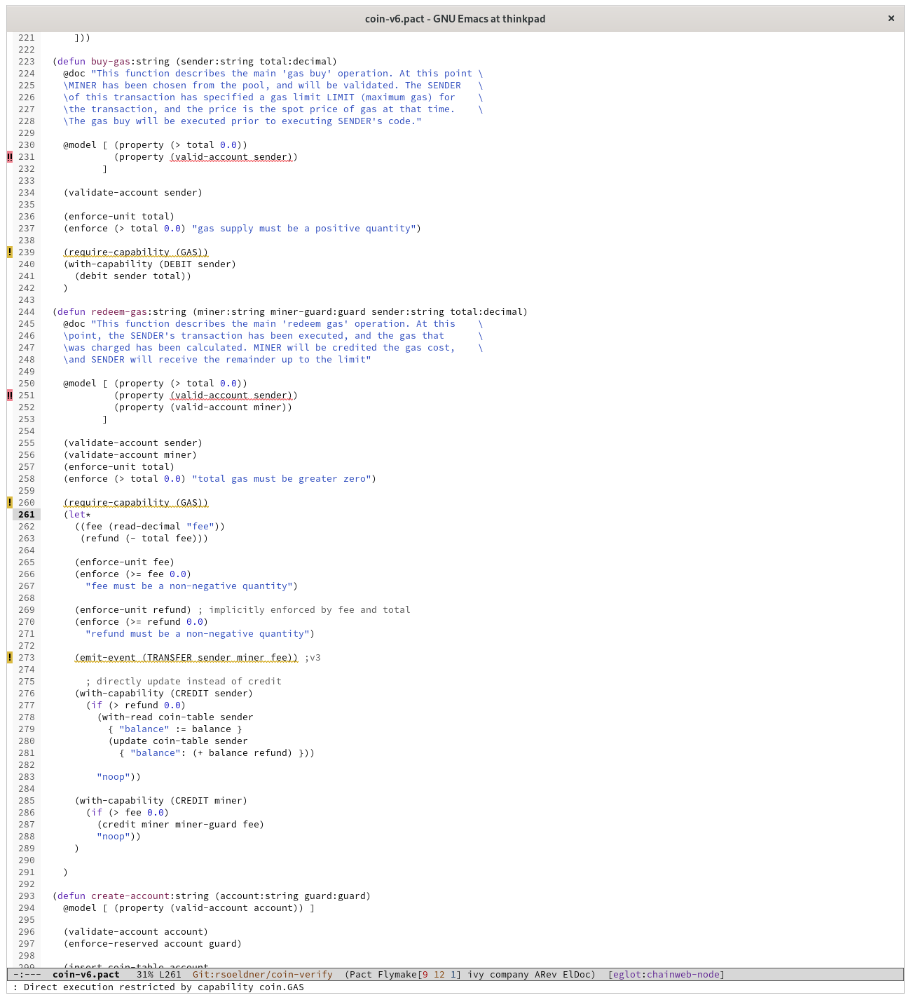
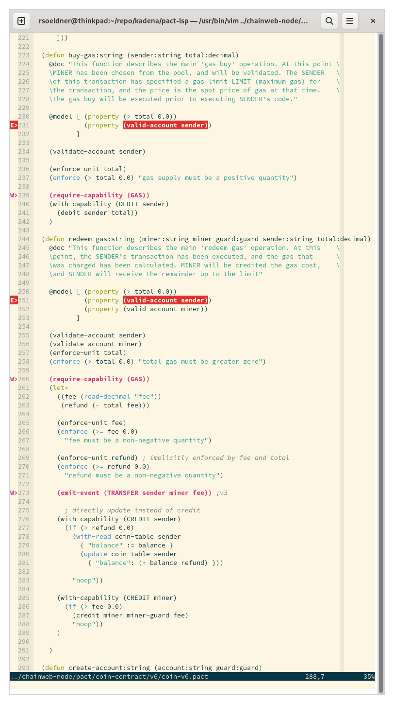

# Pact Language Server

[Pact](http://kadena.io/build) is an open-source, Turing-**in**complete smart contract language that has been purpose-built with blockchains first in mind. Pact focuses on facilitating transactional logic with the optimal mix of functionality in authorization, data management, and workflow.

**The LSP server requires Pact 4.6**

## Supported Features

The Pact language server currently supports the following features:

  - **Document diagnostics**
  Every time a file is opened or saved, the file is analyzed using the _pact executable_ and diagnostic information is supplied.
  

  - **Completion of natives**
  While typing, the LSP server provides completions for natives.
  
  
  - **Documentation of natives**
  Hovering over natives populates the documentation.
  
  

## Server Configuration

The LSP server needs to access the _pact_ executable. Therefore, users can configure the path of the executable at
server initialization by sending a configuration as follows:

```
{
  "pact": {
    "pactExe": "/path/to/pact"
  }
}
```

## Troubleshooting

The `pact-lsp` executable accepts the `--debug` flag to generate a log file which can be used to further
debug issues.

## Editor Configuration

### Emacs

Using [eglot](https://github.com/joaotavora/eglot):

```
(require 'pact-mode)
(require 'eglot)

(with-eval-after-load 'eglot
  (add-to-list 'eglot-server-programs '(pact-mode . ("pact-lsp" ))))

(add-hook 'pact-mode-hook 'eglot-ensure)
```



### Vim

Using [vim-lsp](github.com/prabirshrestha/vim-lsp):

```
if (executable('pact-lsp'))
  au User lsp_setup call lsp#register_server({
      \ 'name': 'pact-lsp',
      \ 'cmd': {server_info->['pact-lsp']},
      \ 'whitelist': ['pact'],
      \ })
endif
```


