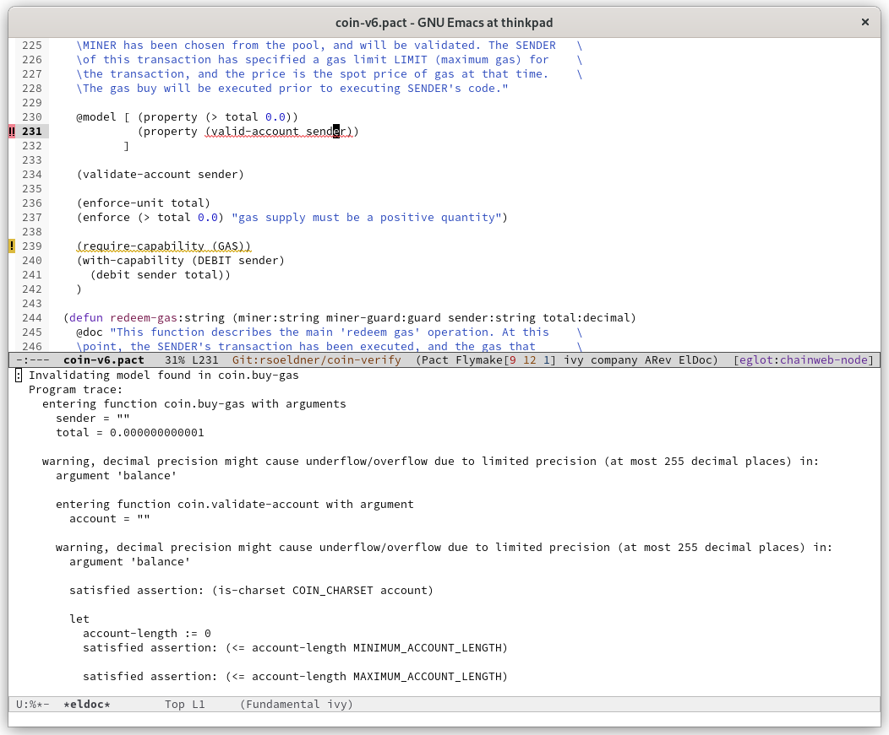
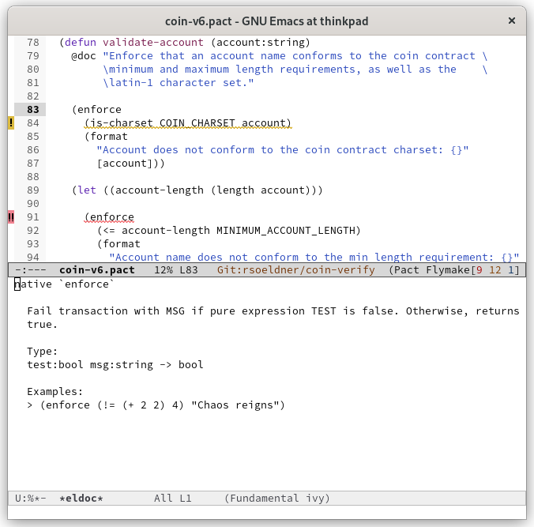

# Pact Language Server

[Pact](http://kadena.io/build) is an open-source, Turing-**in**complete smart contract language that has been purpose-built with blockchains first in mind. Pact focuses on facilitating transactional logic with the optimal mix of functionality in authorization, data management, and workflow.

**The LSP server requires Pact 4.6**

## Supported Features

The Pact language server currently supports the following features:

  - **Document diagnostics**
  Every time a file is opened or saved, the file is analyzed using the _pact executable_ and diagnostic information is supplied.
  

  - **Completion of natives**
  While typing, the LSP server provides completions for natives.
  
  
  - **Documentation of natives**
  Hovering over natives populates the documentation.
  
  

## Server Configuration

The LSP server needs to access the _pact_ executable. Therefore, users can configure the path of the executable at
server initialization by sending a configuration as follows:

```
{
  "pact": {
    "pactExe": "/path/to/pact"
  }
}
```

## Building from Source

### Dependencies
- (Mac only) Homebrew: `brew install git`
- (Linux/Mac) [Installer](https://git-scm.com/downloads)
- Pact executable (see [Instructions](https://github.com/kadena-io/pact))

To get the code, you can go [here](https://github.com/kadena-io/pact-lsp/releases/). Once you have the code, we can pick a build tool.

#### Building with Cabal

[Cabal](https://www.haskell.org/cabal/) is the preferred way to manage packages by the Haskell community. You will need a version of GHC
installed on your machine to use it.

##### Dependencies

- `ghc >= 9.6` (Haskell compiler) and `cabal >= 2.2` (Haskell build-tool)
  - The easiest way to get this is to install it using (Linux/Mac) [ghcup](https://www.haskell.org/ghcup/) and issue `ghcup install 9.6.2`, followed by `ghcup install-cabal`.
  - ghc may also be installed via brew, issuing `brew install ghc` and `brew install cabal-install`.

To build a Pact LSP binary:

```bash
# Only necessary if you haven't done this recently.
cabal v2-update

# Build the project.
cabal v2-build
```

This will install a runnable version of the Pact LSP, which you can run via:

```bash
cabal v2-exec pact-lsp
```

Alternatively, running `cabal v2-install exe:pact-lsp` inside this repository's root will install the binary to `~/.cabal/bin/`, which
you may need to add to your path. Then, you can call `pact-lsp` as-is.


#### Building with Nix

The fastest way to build and run Pact is to use the Nix package manager
which has binary caching capabilities that allow you to download pre-built
binaries for everything needed by Pact.
We use nix flakes (which requires users to set `--experimental-features "nix-command flakes"`)
to build pact and its dependencies. For detailed instructions see [our
wiki](https://github.com/kadena-io/pact/wiki/Building-Kadena-Projects).

To build the Pact executable:
```bash
nix build
```
When the build is finished, you can run the Pact LSP with the following command:

```bash
./result/bin/pact-lsp
```

## Troubleshooting

The `pact-lsp` executable accepts the `--debug` flag to generate a log file which can be used to further
debug issues.

## Editor Configuration

### Emacs

Using [eglot](https://github.com/joaotavora/eglot):

```
(require 'pact-mode)
(require 'eglot)

(with-eval-after-load 'eglot
  (add-to-list 'eglot-server-programs '(pact-mode . ("pact-lsp" ))))

(add-hook 'pact-mode-hook 'eglot-ensure)
```

Using [lsp-mode](https://emacs-lsp.github.io/lsp-mode/)


```
(require 'pact-mode)
(require 'lsp-mode)

(add-to-list 'lsp-language-id-configuration '(pact-mode . "pact"))
  (lsp-register-client (make-lsp-client
                           :new-connection (lsp-stdio-connection "pact-lsp")
                           :activation-fn (lsp-activate-on "pact")
                           :server-id 'pact-lsp
                           :major-modes 'pact-mode)
                       )
 (add-hook 'pact-mode-hook 'lsp-deferred)
  )

```
or, in [Doom Emacs](https://github.com/doomemacs/doomemacs)

```
(after! (:all pact-mode lsp-mode)
  (add-to-list 'lsp-language-id-configuration '(pact-mode . "pact"))
  (lsp-register-client (make-lsp-client
                           :new-connection (lsp-stdio-connection "pact-lsp")
                           :activation-fn (lsp-activate-on "pact")
                           :server-id 'pact-lsp
                           :major-modes 'pact-mode)
                       )
  )

(after! pact-mode
  (add-hook 'pact-mode-hook (lambda () (lsp-deferred)))
  )


```


### Vim

Using [vim-lsp](github.com/prabirshrestha/vim-lsp):

```
if (executable('pact-lsp'))
  au User lsp_setup call lsp#register_server({
      \ 'name': 'pact-lsp',
      \ 'cmd': {server_info->['pact-lsp']},
      \ 'whitelist': ['pact'],
      \ })
endif
```


